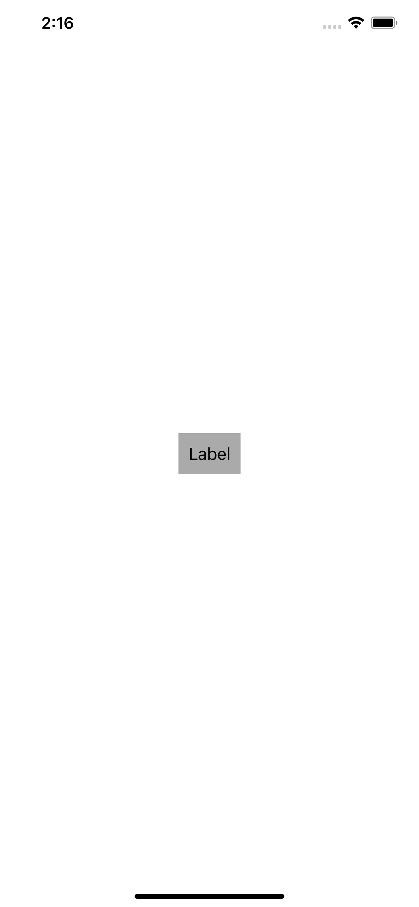

# Dynamic Spacing Example

While font can be dynamic sized, spacing can also be dynamic.

## Under default dynamic type size.

## Under AX5 dynamic type size.

Constant spacing.

Dynamic spacing.

## How to Specify Dynamic Spacing

In the above example, the spacing is (10, body), which means:

- Under default(large) dynamic size, the spacing is 10pt.
- Under non-default dynamic size, the spacing scales relative to body text.