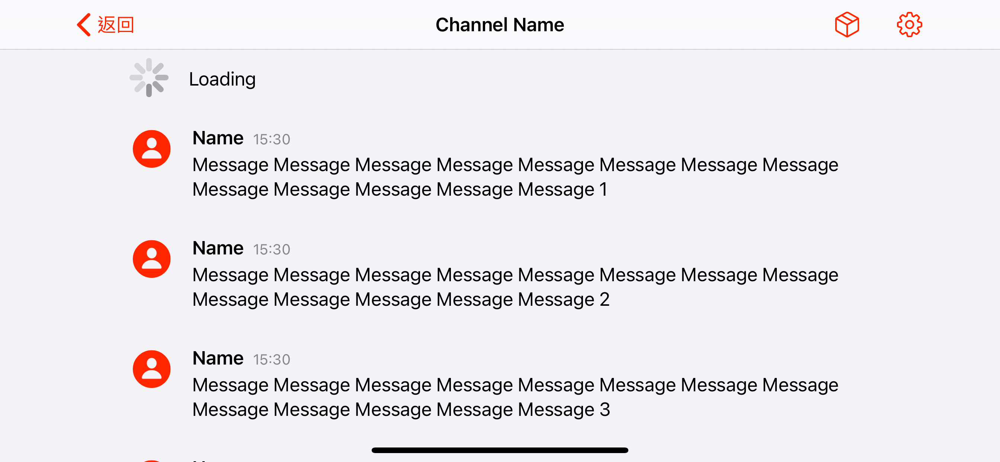

# Reabable Content Guide Example

Same code running in all examples.

Devices:

- iPhone 11 pro max
- iPad pro 12.9 inch

For devs:

- CollectionView snaps to view's edge, system auto insets scrollview.
- Cell content snaps to cell.contentView.readableContentGuide

iPhone portrait

iPhone portrait context menu

iPhone landscape

iPhone landscape context menu

iPad portrait

iPad portrait context menu

iPad landscape

iPad landscape context menu

iPad split view 1/2

iPad split view 1/3

iPad slide over

